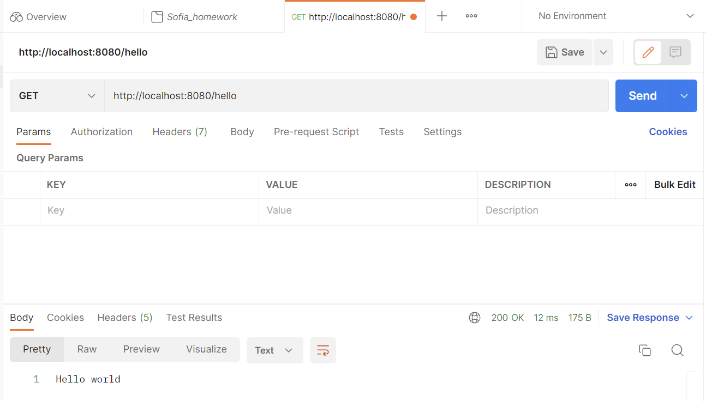
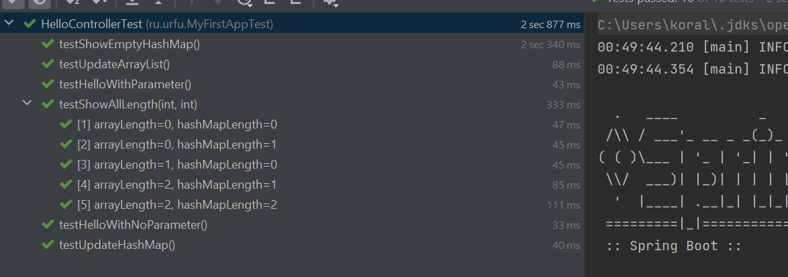

## Лабораторные работы к курсу по Spring Boot

## Лабораторная работа 1
- [x] Реализовать простейшее Spring Boot приложение
- [x] Реализовать дополнительный функциональность в разработанном по примеру Spring Boot приложении
- [x] Ответить письменно на вопросы в соответствии с номером в списке
- [x] Оформить отчет и прикрепить его на сайте преподавателя

### Краткий предотчет об успешной работе приложения

1. Реализация простейшего Spring Boot приложения по лекционному занятию

Написаны автотесты на метод контроллера hello

2. Реализация дополнительной функциональности 
***(творческое задание, применила dependency injection, написала автотесты, сделала автосборку докер образа
и просканировала код статическими анализаторами spotbugs, pmd, trivy)***

